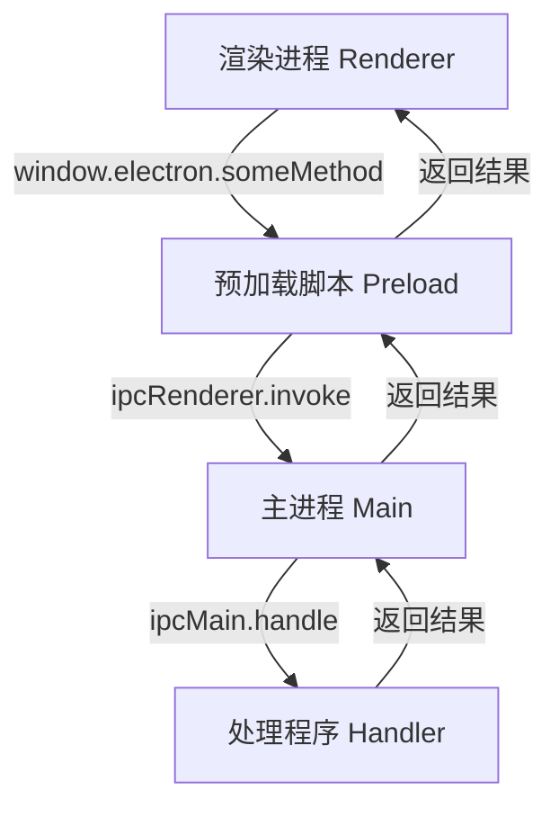

# Electron IPC 通信机制详解

## 1. IPC 概述

IPC (Inter-Process Communication) 是 Electron 中主进程和渲染进程之间通信的机制。在 Electron 应用中，主进程和渲染进程运行在不同的上下文中，需要通过 IPC 来实现进程间的通信。

## 2. 架构图



## 3. 各层实现详解

### 3.1 渲染进程层 (Renderer Process)

渲染进程是用户界面所在的进程，主要包含：
- React/Vue 等前端框架代码
- 用户界面交互逻辑
- 通过 `window.electron` 调用主进程功能

```typescript
// 示例：在渲染进程中调用主进程功能
async function handleStartRecording() {
  try {
    const result = await window.electron.startRecording();
    if (result.success) {
      console.log('Recording started:', result.path);
    }
  } catch (error) {
    console.error('Failed to start recording:', error);
  }
}
```

### 3.2 预加载脚本层 (Preload Script)

预加载脚本是连接渲染进程和主进程的桥梁，主要职责：
- 通过 contextBridge 暴露安全的 API
- 封装 ipcRenderer 调用
- 提供类型安全的接口

```typescript
// src/preload.ts
contextBridge.exposeInMainWorld('electron', {
  startRecording: () => ipcRenderer.invoke('audio:start'),
  stopRecording: () => ipcRenderer.invoke('audio:stop'),
  // ... 其他方法
});
```

### 3.3 主进程层 (Main Process)

主进程是 Electron 应用的核心，负责：
- 注册 IPC 处理程序
- 实现具体的功能逻辑
- 管理系统资源
- 处理操作系统交互

```typescript
// src/main/audio.ts
export function setupAudioIPC() {
  ipcMain.handle('audio:start', async () => {
    try {
      // 实现录音逻辑
      return { success: true, path: recordingPath };
    } catch (error) {
      return { success: false, error: error.message };
    }
  });
}
```

## 4. 类型定义

### 4.1 渲染进程类型 (Renderer Types)

在 `src/renderer/types/electron.d.ts` 中定义：
```typescript
interface ElectronAPI {
  startRecording: () => Promise<{ success: boolean; path?: string }>;
  stopRecording: () => Promise<{ success: boolean }>;
  // ... 其他方法
}

interface Window {
  electron: ElectronAPI;
}
```

### 4.2 共享类型 (Shared Types)

在 `src/shared/types` 中定义共享的接口和类型：
```typescript
interface AudioConfig {
  sampleRate: number;
  channels: number;
  bitDepth: number;
  format: string;
}
```

## 5. 安全性考虑

### 5.1 contextIsolation

启用 contextIsolation 确保渲染进程不能直接访问 Node.js API：
```typescript
new BrowserWindow({
  webPreferences: {
    contextIsolation: true,
    nodeIntegration: false,
    preload: path.join(__dirname, 'preload.js')
  }
});
```

### 5.2 参数验证

在主进程中验证来自渲染进程的参数：
```typescript
ipcMain.handle('task:update', async (_, id: string, updates: any) => {
  if (!id || typeof id !== 'string') {
    return { success: false, error: 'Invalid task ID' };
  }
  // ... 处理逻辑
});
```

## 6. 错误处理

### 6.1 渲染进程错误处理
```typescript
try {
  await window.electron.startRecording();
} catch (error) {
  console.error('Recording failed:', error);
  showErrorNotification(error.message);
}
```

### 6.2 主进程错误处理
```typescript
ipcMain.handle('audio:start', async () => {
  try {
    // ... 处理逻辑
    return { success: true, data: result };
  } catch (error) {
    console.error('Error in audio:start:', error);
    return { 
      success: false, 
      error: error instanceof Error ? error.message : 'Unknown error'
    };
  }
});
```

## 7. 最佳实践

### 7.1 命名规范
- Channel 名称使用 `domain:action` 格式
- 方法名使用 camelCase
- 类型名使用 PascalCase

### 7.2 返回值格式
统一使用以下格式：
```typescript
{
  success: boolean;      // 操作是否成功
  data?: any;           // 成功时的返回数据
  error?: string;       // 失败时的错误信息
  path?: string;        // 可选的文件路径等
}
```

### 7.3 代码组织
- 相关的 IPC 处理程序放在同一个文件中
- 按功能模块组织代码
- 使用类型定义确保类型安全

## 8. 调试技巧

### 8.1 主进程调试
```typescript
console.log('Main Process:', {
  event: 'audio:start',
  params: { sampleRate, channels }
});
```

### 8.2 渲染进程调试
```typescript
console.log('Renderer Process:', {
  method: 'startRecording',
  result: await window.electron.startRecording()
});
```

## 9. 性能优化

### 9.1 数据传输
- 避免传输大量数据
- 使用流式传输处理大文件
- 考虑使用共享内存或临时文件

### 9.2 处理程序优化
- 异步处理耗时操作
- 适当使用缓存
- 避免频繁的 IPC 通信

## 10. 常见问题和解决方案

### 10.1 类型错误
问题：`Property 'electron' does not exist on type 'Window'`
解决：确保在 `electron.d.ts` 中正确扩展 Window 接口

### 10.2 通信超时
问题：IPC 调用没有响应
解决：添加超时处理和错误重试机制

### 10.3 内存泄漏
问题：未正确清理 IPC 处理程序
解决：在组件卸载时移除事件监听器 